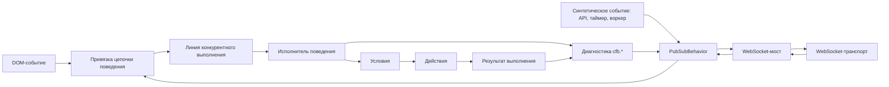

# CFB — поведение цепочек функций

CFB — это TypeScript-фреймворк, который превращает сценарии приложения в исполняемые цепочки поведения. Он связывает типизированные события с переиспользуемыми синхронными и асинхронными функциями с помощью декларативных стратегий, условий, правил конкурентного выполнения и веток обработки ошибок.

Одна и та же модель поведения может выполняться в браузере, API-сервисе, воркере или процессе, подключённом по WebSocket. Код приложения управляет состоянием предметной области и побочными эффектами, а CFB — оркестрацией.

## Манифест

Пользовательский сценарий, схема корпоративной архитектуры или интеллект-карта должны естественным образом преобразовываться в цепочку функций. CFB сохраняет эту цепочку явной, чтобы продуктовое поведение не растворялось в обработчиках интерфейса, транспортных колбэках и специфичном для сервисов потоке управления.

Фреймворк отделяет **что должно произойти** от **где и как выполняется каждая функция**:

- события выбирают точку входа;
- стратегии описывают порядок выполнения и условия;
- действия реализуют поведение предметной области;
- привязки соединяют браузерные и серверные источники событий;
- исполнитель возвращает данные, патчи, события, трассировку и нормализованный результат.

## Поток выполнения



## Установка

```bash
npm install chain-functions-behavior
```

## Цепочка поведения

`createChainBehavior` — это среда выполнения, с которой взаимодействует приложение. Она объединяет:

- конфигурацию поведения со стратегиями и точками входа;
- действия и условия приложения;
- значение контекста или поставщик контекста;
- привязки событий шины и DOM;
- параметры конкурентного выполнения и жизненного цикла;
- исполнитель поведения, созданный для этого определения.

`start()` проверяет конфигурацию и устанавливает доступные привязки. `stop()` удаляет их. В средах без DOM DOM-привязки становятся неактивными, а привязки шины продолжают работать как на клиенте, так и на сервере.

```ts
import { createChainBehavior, createPubSubBehavior } from 'chain-functions-behavior'

type Context = {
  orders: Map<string, { id: string; status: 'draft' | 'submitted' }>
}

type Events = {
  'order.submit': { orderId: string }
}

const context: Context = {
  orders: new Map([['order-1', { id: 'order-1', status: 'draft' }]]),
}

const bus = createPubSubBehavior<Events>()

const behavior = createChainBehavior<Context, unknown, Events>(
  {
    events: {
      '[bus] order.submit': {
        entrypoint: 'order.submit',
        options: {
          concurrency: {
            mode: 'latest',
            key: ({ orderId }) => orderId,
          },
        },
      },
    },
    actions: {
      'order.submit': ({ context, input }) => {
        const order = context.orders.get(input.orderId as string)

        if (order) {
          order.status = 'submitted'
        }
      },
    },
    config: {
      entrypoints: {
        'order.submit': 'order.submit',
      },
      strategies: {
        'order.submit': {
          fn: 'order.submit',
        },
      },
    },
  },
  {
    bus,
    context,
    onRunnerError: ({ error, entrypoint, runId }) => {
      console.error('Behavior failed', { error, entrypoint, runId })
    },
  }
)

const started = behavior.start()

bus.emit('order.submit', { orderId: 'order-1' }, { origin: 'api' })

behavior.stop()
```

`start()` возвращает активные и неактивные привязки вместе с результатом проверки конфигурации. Повторный вызов заменяет привязки, установленные предыдущим запуском.

## Источники событий

Цепочка поведения принимает несколько источников событий, не связывая действия с конкретным транспортом:

- `[bus] <topic>` принимает типизированные события `PubSubBehavior`;
- `[dom] <selector>:<event>` делегирует браузерные события от `document` или настроенного корневого элемента;
- код приложения создаёт синтетические события через `bus.emit()` из API-колбэков, таймеров, воркеров или тестов;
- `createBehaviorWs` передаёт выбранные конверты шины через WebSocket-подобный транспорт и отправляет разрешённые входящие конверты обратно в шину.

Входные DOM-данные нормализуются до `{ type, value?, dataset, form? }`. Для событий отправки формы `preventDefault` по умолчанию равен `true`. На сервере DOM-привязки отмечаются как неактивные, не вызывая ошибку запуска поведения.

## Конкурентное выполнение и жизненный цикл

Каждая привязка поддерживает режимы `parallel`, `latest`, `queue` и `drop`. Привязка может вычислять ключ линии из полезной нагрузки, позволяя несвязанным сущностям выполняться независимо.

Действия получают `AbortSignal`. Режим `latest` прерывает предыдущий запуск в той же линии, а `behavior.stop({ force: true })` — все активные запуски. Отмена является кооперативной: действия должны передавать сигнал запросам, таймерам и другой асинхронной работе.

CFB публикует диагностику жизненного цикла через настроенную шину, включая `cfb.run.started`, `cfb.run.finished`, `cfb.run.failed`, `cfb.run.cancelled`, `cfb.run.dropped` и `cfb.queue.overflow`.

## Запускаемый пример

[`examples/todo-app`](examples/todo-app) — это микроприложение на Bun с DOM-привязками, синтетическими событиями шины и синхронизацией вкладок браузера через WebSocket в реальном времени. Его состояние, действия, конфигурация, привязки и настройка транспорта намеренно собраны в одном файле `src/app.ts`.

```bash
npm run build
cd examples/todo-app
bun install
bun run dev
```

Откройте `http://localhost:4173` в двух вкладках браузера, чтобы увидеть передачу конвертов событий через WebSocket-мост.

## Спецификация

[SPEC-RU.md](SPEC-RU.md) определяет полный технический контракт, включая:

- API исполнителя и реестров;
- встроенные действия и условия;
- режимы выполнения и выражения условий;
- вспомогательные средства среды выполнения, проверку, трассировку и ограничения безопасности;
- конверты PubSub и поведение при ошибках;
- привязки цепочки поведения и конкурентное выполнение;
- нормализацию DOM и поведение WebSocket-транспорта.

## Разработка

```bash
npm test
npm run build
npm run pack:check
```
