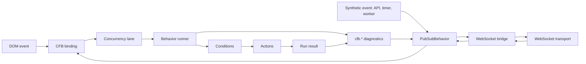

# CFB - Chain Functions Behavior

A package for declaratively executing synchronous and asynchronous actions in chains with conditions, fallback branches, trace output, and safety limits.

The runner is unaware of the application's domain model. The application registers actions and conditions, supplies context and input, and receives status, data, patches, events, and trace output.

## Manifest

CFB turns user scenarios into executable behavior without a gap between architecture and code.

A user story, enterprise architecture diagram, or Mindjet map should translate naturally into a chain of strategies, conditions, and actions. The same behavior model runs on the client and server: UI events, business processes, and transport messages trigger the same scenarios.

The framework separates **what should happen** from **where and how it runs**. Teams discuss behavior in product and architecture terms, then implement it consistently through configuration, actions, and integrations.

## Runtime Flow



## Installation

```bash
npm install chain-functions-behavior
```

Build the package:

```bash
npm run build
```

Inspect the publish archive:

```bash
npm run pack:check
```

The complete framework contract is documented in [SPEC.md](SPEC.md).

## Quick Start

```ts
import { createBehaviorRunner, defineBehaviorConfig } from 'chain-functions-behavior'

type Context = {
  worker: {
    state: 'idle' | 'busy'
    queueSize: number
  }
}

const config = defineBehaviorConfig({
  version: 1,
  entrypoints: {
    'worker.tick': 'worker.tick',
  },
  strategies: {
    'worker.tick': {
      fn: 'core.selector',
      mode: 'selector',
      then: ['worker.pickQueuedJob', 'worker.idle'],
    },
    'worker.pickQueuedJob': {
      fn: 'jobs.findNext',
      when: ['and', ['eq', '$context.worker.state', 'idle'], ['gt', '$context.worker.queueSize', 0]],
      then: ['jobs.execute'],
    },
    'jobs.execute': {
      fn: 'jobs.execute',
    },
    'worker.idle': {
      fn: 'core.noop',
    },
  },
})

const runner = createBehaviorRunner<Context, { type: string }>()

runner.registerAction('jobs.findNext', () => ({ data: { jobId: 'job-1' } }))
runner.registerAction('jobs.execute', ({ runtime }) => {
  runtime.emit({ type: 'job.executed', payload: { jobId: runtime.getData('jobId') } })
  return { patch: { type: 'job.executed' } }
})

runner.loadConfig(config)

const result = await runner.run('worker.tick', {
  worker: { state: 'idle', queueSize: 1 },
})
```

## Examples

`examples/todo-app` is a runnable Bun microapp that keeps DOM bindings, synthetic bus events, and a WebSocket bridge in one `src/app.ts` file.

```bash
npm run build
cd examples/todo-app
bun install
bun run dev
```

Open `http://localhost:4173` in two browser tabs. A task created, toggled, or removed in one tab is delivered to the other as a CFB bus envelope through the built-in Bun WebSocket server.

## Public API

```ts
createBehaviorRunner<TContext, TPatch>(options?)
defineBehaviorConfig(config)
createMemoryTraceSink()
defineErrorReporter(handler)
createPubSubBehavior<TEvents>(options?)
PubSubBehavior
createChainBehavior(definition, options)
```

Runner API:

```ts
runner.registerAction(name, action)
runner.registerActions(actions)
runner.registerCondition(name, condition)
runner.registerConditions(conditions)
runner.loadConfig(config)
runner.validateConfig(config?)
runner.run(entrypoint, context, input?)
runner.runSync(entrypoint, context, input?)
```

`runSync` throws when it encounters an asynchronous action.

## Error Reporting

The runner does not throw for normal `failed`, `skipped`, or `stopped` results. Errors from actions, conditions, entrypoints, and safety limits are normalized into `BehaviorError`; applications can attach one reporter for Sentry, the console, or another monitoring system.

```ts
import { createBehaviorRunner, defineErrorReporter } from 'chain-functions-behavior'

const reportBehaviorError = defineErrorReporter({
  report: ({ error, data, trace }) => {
    Sentry.captureException(error.cause ?? error, {
      tags: {
        code: error.code,
        phase: error.stage?.phase,
        strategy: error.stage?.strategy,
        fn: error.stage?.fn,
      },
      extra: { data, trace },
    })
  },
})

const runner = createBehaviorRunner({
  trace: true,
  onError: reportBehaviorError,
})
```

`BehaviorError.stage` identifies the execution phase:

- `entrypoint`;
- `condition`;
- `action`;
- `catch`;
- `limit`.

If a strategy recovers through `catch`, the reporter still receives the original error while the final `run` may return `status: 'success'`.

## Registry

Each runner creates two registries:

- `actionsRegistry`
- `conditionsRegistry`

They are created through:

```ts
createActionsRegistry()
createConditionsRegistry()
```

Registries are prepopulated with built-ins, but applications can override any name:

```ts
runner.registerAction('core.setData', customSetData)
runner.registerCondition('eq', customEq)
```

An override applies only to that runner.

## Built-In Actions

- `core.noop`
- `core.stop`
- `core.fail`
- `core.sequence`
- `core.selector`
- `core.parallel`
- `core.set`
- `core.setData`
- `core.emit`
- `core.patch`
- `core.delay`

## Built-In Conditions

- `eq`, `neq`
- `gt`, `gte`, `lt`, `lte`
- `truthy`, `falsy`
- `exists`, `missing`
- `empty`, `notEmpty`
- `includes`
- `changed`
- `cooldownReady`

## Execution Modes

`sequence` executes every `then` target in order.

`selector` walks `then` targets until the first successful or stopped result. `skip` means that the branch did not match.

`parallel` runs `then` targets independently and returns patches and events to the caller.

## Runtime

An action receives:

```ts
{
  context,
  props,
  input,
  runtime,
}
```

Runtime helpers:

- `runtime.get(path)` reads context;
- `runtime.getData(path)` reads the temporary data bag;
- `runtime.setData(path, value)` writes to the temporary data bag;
- `runtime.resolve(value)` resolves `$context`, `$data`, and `$input` references;
- `runtime.emit(event)` appends an event to the result;
- `runtime.patch(patch)` appends a patch to the result;
- `runtime.stop(reason)` creates a stopped result;
- `runtime.fail(reason, data)` creates a failed result.

Runtime path reads and writes use an `objwalk` adapter. The public contract remains behavior-level: applications use `runtime.get`, `runtime.getData`, `runtime.setData`, and `$context`/`$data`/`$input` references.

## Validation

`validateConfig` validates configuration through the registries:

- action names through `actionsRegistry.has`;
- condition operators through `conditionsRegistry.has`;
- strategy references;
- modes;
- path references;
- cycles.

## Trace

Enable trace with an option:

```ts
const runner = createBehaviorRunner({ trace: true })
```

Trace records selected strategies, props, status, data before and after execution, and duration.

## Pub/Sub

`PubSubBehavior` is a process-local singleton event bus. Use `createPubSubBehavior` for SSR, tests, and multiple isolated applications.

```ts
import { createPubSubBehavior, PubSubBehavior } from 'chain-functions-behavior'

type AppEvents = {
  'auth.signed-in': { userId: string }
}

const bus = createPubSubBehavior<AppEvents>()
const unsubscribe = bus.on('auth.signed-in', ({ parsed, serialized }) => {
  console.log(parsed.userId)
  socket.send(serialized)
})

const event = bus.emit('auth.signed-in', { userId: 'ada' }, { origin: 'ui' })
unsubscribe()

PubSubBehavior.on('app.ready', ({ parsed }) => {
  console.log(parsed)
})
PubSubBehavior.emit('app.ready', { source: 'server' })
```

Each `emit` call creates one envelope:

```ts
{
  id: nanoid(),
  topic: 'auth.signed-in',
  occurredAt: Date.now(),
  origin: 'ui',
  parsed: { userId: 'ada' },
  serialized: '{"userId":"ada"}',
}
```

`on` returns an unsubscribe function. `off(event, handler)` removes one subscription, while `off(event)` clears the channel. Subscribers run in registration order; an exception from one handler does not block the others and is reported to `onError` on an isolated bus. On serialization failure, subscribers still receive an envelope with `parsed: { error }` and a serialized error body; the original cause is also reported to `onError`.

## Chain Behavior

`createChainBehavior` combines configuration, actions, conditions, a context provider, and event bindings into one lifecycle. It supports `[bus] <event-name>` bindings.

```ts
import { createChainBehavior, createPubSubBehavior } from 'chain-functions-behavior'

type Events = {
  'form.submit': { email: string }
}

const bus = createPubSubBehavior<Events>()
const behavior = createChainBehavior(
  {
    actions: {
      'form.save': ({ input }) => saveForm(input),
    },
    events: {
      '[bus] form.submit': { entrypoint: 'form.submit' },
    },
    config: {
      entrypoints: { 'form.submit': 'form.save' },
      strategies: { 'form.save': { fn: 'form.save' } },
    },
  },
  {
    bus,
    context: () => appStore.getState(),
  }
)

const started = behavior.start()
bus.emit('form.submit', { email: 'ada@example.com' })
behavior.stop()
```

`start()` registers actions and conditions, validates configuration, and installs bindings only after successful validation. It returns `active`, `inactive`, and `validation`. Calling `start()` again replaces existing subscriptions. `stop()` releases only the current behavior's bindings.

`onRunnerError` is called only for a final `status: 'failed'`. The callback receives `{ error, result, binding, entrypoint, runId, key }`; a strategy recovered through `catch` does not trigger this hook.

### Concurrency

Each binding supports `parallel`, `latest`, `queue`, and `drop`. Concurrency is scoped to a binding and lane; `key` creates independent lanes for separate entities.

```ts
'[bus] form.submit': {
  entrypoint: 'form.submit',
  options: {
    concurrency: {
      mode: 'latest',
      key: ({ formId }) => formId,
    },
  },
}
```

Defaults are set in `createChainBehavior` options and can be overridden by a binding. `queue` supports `maxQueueSize` (default `50`) and `overflow: 'drop-oldest' | 'drop-newest'`.

Actions and `runtime` receive `signal: AbortSignal`. `latest` aborts the previous run in the same lane, while `behavior.stop({ force: true })` aborts every active run. Abort is cooperative: an action must use the signal in fetches, timers, and its own asynchronous work.

CFB publishes diagnostics to its bus: `cfb.run.started`, `cfb.run.finished`, `cfb.run.failed`, `cfb.run.cancelled`, `cfb.run.dropped`, and `cfb.queue.overflow`.

### DOM Bindings

A DOM binding uses the `[dom] <css-selector>:<event>` key. `createChainBehavior` installs a delegated listener on `options.root` or `document` in the browser. In SSR or backend runtimes, the binding becomes `inactive` with reason `dom-unavailable`.

```ts
const behavior = createChainBehavior(
  {
    events: {
      '[dom] .app-button[type="submit"]:click': {
        entrypoint: 'form.submit',
        options: {
          preventDefault: true,
          concurrency: { mode: 'drop' },
        },
      },
    },
    config,
  },
  { context: () => appStore.getState(), root: document }
)
```

The default input is `{ type, value, dataset, form }`. `dataset` collects `data-*` attributes from the matching element as camelCase keys. `form` is collected from the nearest form, and repeated fields become arrays. `preventDefault` defaults to `true` for `submit`; it and `stopPropagation` default to `false` for other events. The `input` mapper can return any `BehaviorInput`.

### WebSocket Bridge

`createBehaviorWs` connects a bus to a WebSocket-like transport. Inbound topics pass an allowlist and preserve the original envelope through `bus.dispatch(event)`. Outbound topics send the already prepared `event.serialized`.

```ts
const ws = createBehaviorWs({
  bus,
  createSocket: () => new WebSocket('wss://example.com/behavior'),
  inboundTopics: ['order.created'],
  outboundTopics: ['cfb.run.finished', 'cfb.run.failed'],
  origin: 'ui',
  retry: {
    initialDelay: 500,
    maxDelay: 10_000,
    multiplier: 2,
    jitter: true,
  },
})

ws.start()
```

The bridge works with browser WebSocket and a server-side adapter implementing the `BehaviorWsSocket` contract. It publishes `cfb.ws.connecting`, `cfb.ws.connected`, `cfb.ws.disconnected`, `cfb.ws.retrying`, and `cfb.ws.message.rejected`.

## Project Checks

```bash
npm run typecheck
npm test
npm run build
```

Inspect the publish archive:

```bash
npm run verify
```
