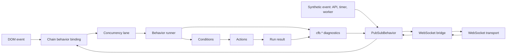

# CFB - Chain Functions Behavior

CFB is a TypeScript framework for turning application scenarios into executable behavior chains. It connects typed events to reusable synchronous and asynchronous functions through declarative strategies, conditions, concurrency rules, and error branches.

The same behavior model can run in a browser, API service, worker, or WebSocket-connected process. Application code owns the domain state and side effects; CFB owns orchestration.

## Manifest

A user story, enterprise architecture diagram, or mind map should translate naturally into a chain of functions. CFB keeps that chain explicit so product behavior does not disappear into UI handlers, transport callbacks, and service-specific control flow.

The framework separates **what should happen** from **where and how each function runs**:

- events select an entrypoint;
- strategies describe execution order and conditions;
- actions implement domain behavior;
- bindings connect browser and server event sources;
- the runner returns data, patches, events, trace, and a normalized result.

## Runtime Flow



## Installation

```bash
npm install chain-functions-behavior
```

## Chain Behavior

`createChainBehavior` is the application-facing runtime. It combines:

- a behavior config with strategies and entrypoints;
- application actions and conditions;
- a context value or context provider;
- bus and DOM event bindings;
- concurrency and lifecycle options;
- a behavior runner created for this definition.

`start()` validates the config and installs available bindings. `stop()` removes those bindings. DOM bindings become inactive in runtimes without a DOM, while bus bindings continue to work on both client and server.

```ts
import { createChainBehavior, createPubSubBehavior } from 'chain-functions-behavior'

type Context = {
  orders: Map<string, { id: string; status: 'draft' | 'submitted' }>
}

type Events = {
  'order.submit': { orderId: string }
}

const context: Context = {
  orders: new Map([['order-1', { id: 'order-1', status: 'draft' }]]),
}

const bus = createPubSubBehavior<Events>()

const behavior = createChainBehavior<Context, unknown, Events>(
  {
    events: {
      '[bus] order.submit': {
        entrypoint: 'order.submit',
        options: {
          concurrency: {
            mode: 'latest',
            key: ({ orderId }) => orderId,
          },
        },
      },
    },
    actions: {
      'order.submit': ({ context, input }) => {
        const order = context.orders.get(input.orderId as string)

        if (order) {
          order.status = 'submitted'
        }
      },
    },
    config: {
      entrypoints: {
        'order.submit': 'order.submit',
      },
      strategies: {
        'order.submit': {
          fn: 'order.submit',
        },
      },
    },
  },
  {
    bus,
    context,
    onRunnerError: ({ error, entrypoint, runId }) => {
      console.error('Behavior failed', { error, entrypoint, runId })
    },
  }
)

const started = behavior.start()

bus.emit('order.submit', { orderId: 'order-1' }, { origin: 'api' })

behavior.stop()
```

`start()` returns active and inactive bindings together with the config validation result. Calling it again replaces bindings installed by the previous start.

## Event Sources

Chain behavior accepts multiple event sources without coupling actions to a transport:

- `[bus] <topic>` consumes typed `PubSubBehavior` events;
- `[dom] <selector>:<event>` delegates browser events from `document` or a configured root;
- application code produces synthetic events with `bus.emit()` from API callbacks, timers, workers, or tests;
- `createBehaviorWs` forwards selected bus envelopes through a WebSocket-like transport and dispatches allowed inbound envelopes back to the bus.

DOM input is normalized to `{ type, value?, dataset, form? }`. For submit events, `preventDefault` defaults to `true`. On the server, DOM bindings are reported as inactive instead of failing behavior startup.

## Concurrency And Lifecycle

Each binding supports `parallel`, `latest`, `queue`, and `drop` modes. A binding can derive a lane key from its payload, allowing unrelated entities to execute independently.

Actions receive an `AbortSignal`. `latest` aborts the previous run in the same lane, and `behavior.stop({ force: true })` aborts all active runs. Cancellation is cooperative: actions must pass the signal to fetches, timers, or other asynchronous work.

CFB publishes lifecycle diagnostics through the configured bus, including `cfb.run.started`, `cfb.run.finished`, `cfb.run.failed`, `cfb.run.cancelled`, `cfb.run.dropped`, and `cfb.queue.overflow`.

## Runnable Example

[`examples/todo-app`](examples/todo-app) is a Bun microapp with DOM bindings, synthetic bus events, and live WebSocket synchronization between browser tabs. Its state, actions, configuration, bindings, and transport setup are intentionally kept together in one `src/app.ts` file.

```bash
npm run build
cd examples/todo-app
bun install
bun run dev
```

Open `http://localhost:4173` in two browser tabs to observe event envelopes propagating through the WebSocket bridge.

## Specification

[SPEC.md](SPEC.md) defines the complete technical contract, including:

- runner and registry APIs;
- built-in actions and conditions;
- execution modes and condition expressions;
- runtime helpers, validation, trace, and safety limits;
- PubSub envelopes and error behavior;
- chain behavior bindings and concurrency;
- DOM normalization and WebSocket transport behavior.

## Development

```bash
npm test
npm run build
npm run pack:check
```
