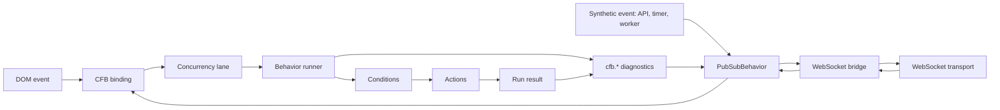

# Chain Functions Behavior Specification

`chain-functions-behavior` is an npm package for declaratively executing synchronous and asynchronous actions in ordered chains with execution conditions, fallback branches, trace output, and safety limits.

The package is not coupled to a UI, server framework, scheduler, or domain model. An application registers actions and conditions, supplies context and input, and the runner returns the chain execution result.

## Runtime Flow



## Public API

```ts
import {
  createBehaviorRunner,
  defineBehaviorConfig,
  createMemoryTraceSink,
  defineErrorReporter,
  createPubSubBehavior,
  PubSubBehavior,
  createChainBehavior,
  createBehaviorWs,
  catchError,
} from 'chain-functions-behavior'
```

```ts
const runner = createBehaviorRunner<Context, Patch>()
runner.registerAction('jobs.execute', executeJob)
runner.registerCondition('hasQueue', ({ context }) => context.queue.length > 0)

runner.loadConfig(config)
const result = await runner.run('worker.tick', context, input)
```

## Core Types

```ts
type BehaviorConfig = {
  version?: 1
  strategies: Record<string, BehaviorStrategy>
  entrypoints?: Record<string, string>
}

type BehaviorStrategy = {
  fn: string
  props?: Record<string, unknown>
  when?: BehaviorConditionExpression
  then?: BehaviorNext[]
  catch?: BehaviorNext[]
  mode?: 'sequence' | 'selector' | 'parallel'
  terminal?: boolean
}
```

## Error Reporting

The runner works as a declarative try/catch pipeline: an action can return `runtime.fail(...)` or throw, a strategy can define `catch`, and an application can centrally report errors through `onError`.

```ts
const reportBehaviorError = defineErrorReporter({
  report: ({ error, context, input, data, patches, events, trace }) => {
    Sentry.captureException(error.cause ?? error, {
      tags: {
        code: error.code,
        phase: error.stage?.phase,
        strategy: error.stage?.strategy,
        fn: error.stage?.fn,
      },
      extra: { context, input, data, patches, events, trace },
    })
  },
})

const runner = createBehaviorRunner({
  trace: true,
  onError: reportBehaviorError,
})
```

`onError` receives `BehaviorErrorEvent`:

```ts
type BehaviorErrorEvent<TContext, TPatch> = {
  error: BehaviorError
  context: TContext
  input: BehaviorInput
  data: Record<string, unknown>
  patches: TPatch[]
  events: BehaviorEvent[]
  trace?: BehaviorTraceEntry[]
}
```

`BehaviorError.stage` identifies the chain phase:

```ts
type BehaviorErrorStage = {
  phase: 'entrypoint' | 'condition' | 'action' | 'catch' | 'limit'
  entrypoint?: string
  strategy?: string
  fn?: string
  mode?: BehaviorMode
  step?: number
  depth?: number
}
```

If an error is recovered through `catch`, `onError` is still invoked for the original failure and the final `run` may finish with `success`.

## Registry Model

The runner uses runner-scoped registries:

```text
src/registry/
  actions.ts
  conditions.ts
```

`createActionsRegistry()` creates a `Map` prepopulated with built-in actions.

`createConditionsRegistry()` creates a `Map` prepopulated with built-in conditions.

Each runner receives its own mutable registry copy. Applications can override any built-in action or condition:

```ts
runner.registerAction('core.setData', customSetData)
runner.registerCondition('eq', customEq)
```

Built-ins are therefore default values, not a separate immutable layer.

Configuration validation accesses registries through the minimal `has(name)` contract.

## Built-In Actions

- `core.noop`
- `core.stop`
- `core.fail`
- `core.sequence`
- `core.selector`
- `core.parallel`
- `core.set`
- `core.setData`
- `core.emit`
- `core.patch`
- `core.delay`

`core.set` and `core.setData` do the same thing: write temporary chain data through `runtime.setData`.

## Built-In Conditions

- `eq`, `neq`
- `gt`, `gte`, `lt`, `lte`
- `truthy`, `falsy`
- `exists`, `missing`
- `empty`, `notEmpty`
- `includes`
- `changed`
- `cooldownReady`

## Config Example

```ts
export const config = defineBehaviorConfig({
  version: 1,
  entrypoints: {
    'worker.tick': 'worker.tick',
  },
  strategies: {
    'worker.tick': {
      fn: 'core.selector',
      mode: 'selector',
      then: ['worker.pickQueuedJob', 'worker.idle'],
    },
    'worker.pickQueuedJob': {
      fn: 'jobs.findNext',
      when: ['and', ['eq', '$context.worker.state', 'idle'], ['gt', '$context.worker.queueSize', 0]],
      then: ['jobs.reserve', 'jobs.execute'],
    },
    'worker.idle': {
      fn: 'core.noop',
    },
  },
})
```

## Execution Modes

`sequence` executes `then` targets in order.

`selector` executes `then` targets until the first successful or stopped step. `skip` means “try the next option.”

`parallel` runs `then` targets independently. Resulting patches and events are returned to the caller; the runner does not apply them.

## Runtime Helpers

```ts
type BehaviorRuntime = {
  get(path: string): unknown
  getData(path: string): unknown
  setData(path: string, value: unknown): void
  resolve(value: unknown): unknown
  emit(event: BehaviorEvent): void
  patch(patch: unknown): void
  stop(reason?: string): BehaviorActionStop<unknown>
  fail(reason?: string, data?: Record<string, unknown>): BehaviorActionFail
}
```

`runtime.resolve` resolves `$context.*`, `$data.*`, and `$input.*`.

Runtime path get/set is implemented directly through `objwalk`.

## Validation

`validateConfig` validates:

- unknown actions through `actionsRegistry.has(fn)`;
- unknown condition operators through `conditionsRegistry.has(operator)`;
- missing strategies in `then`, `catch`, and `entrypoints`;
- invalid modes;
- invalid path references;
- cycles without a terminal step.

## Trace

Trace entries contain:

- step/depth;
- strategy/fn/mode;
- status;
- input;
- props;
- dataBefore/dataAfter;
- durationMs;
- reason.

Trace does not store a complete context snapshot.

## Pub/Sub Bus

`PubSubBehavior` is a process-local singleton event bus. Use `createPubSubBehavior` for isolated runtimes.

```ts
type AppEvents = {
  'auth.signed-in': { userId: string }
}

const bus = createPubSubBehavior<AppEvents>()
const unsubscribe = bus.on('auth.signed-in', ({ parsed, serialized }) => {
  console.log(parsed.userId)
  socket.send(serialized)
})

bus.emit('auth.signed-in', { userId: 'ada' }, { origin: 'api' })
unsubscribe()
```

```ts
type BehaviorBus<TEvents extends object = Record<string, unknown>> = {
  on<TEvent extends keyof TEvents>(
    event: TEvent,
    handler: (event: BehaviorBusEvent<TEvents[TEvent]>) => void
  ): () => void
  off<TEvent extends keyof TEvents>(event: TEvent, handler?: (event: BehaviorBusEvent<TEvents[TEvent]>) => void): void
  emit<TEvent extends keyof TEvents>(
    topic: TEvent,
    payload: TEvents[TEvent],
    options?: { origin?: string }
  ): BehaviorBusEvent<TEvents[TEvent]>
}

type BehaviorBusEvent<TPayload> = {
  id: string
  topic: string
  occurredAt: number
  origin?: string
  parsed: TPayload
  serialized: string
}
```

`emit` creates an envelope and serializes the payload once before subscribers run. `on` returns an unsubscribe function. `off(event, handler)` removes one handler, while `off(event)` clears the channel. An error in one subscriber does not block the others; `createPubSubBehavior({ onError })` receives the error and original event. On serialization failure, the bus delivers `{ error }` as `parsed` and the error body as `serialized`, then calls `onError` with the original cause.

## Chain Behavior

`createChainBehavior` combines configuration, actions, conditions, a context provider, and event bindings. It creates a runner and supports the `start`/`stop` lifecycle.

```ts
type Events = {
  'form.submit': { email: string }
}

const behavior = createChainBehavior<Context, Patch, Events>(
  {
    actions: { 'form.save': saveForm },
    conditions: { allowed: isAllowed },
    events: { '[bus] form.submit': { entrypoint: 'form.submit' } },
    config,
  },
  { bus, context: () => appStore.getState() }
)

const started = behavior.start()
behavior.stop()
```

A `[bus] <event-name>` binding starts an `entrypoint` from `config.entrypoints`. The event payload must be an object and is passed to the runner as `input`. Context is read for each event, so a context provider returns current state.

```ts
type BehaviorStartResult = {
  active: string[]
  inactive: Array<{ binding: string; reason: 'unsupported-source' }>
  validation: BehaviorValidationResult
}
```

`start()` registers actions and conditions, validates and loads configuration. Bindings are not installed after failed validation. Calling `start()` again replaces existing bindings. `stop()` releases only subscriptions owned by the current behavior.

`onRunnerError` in `ChainBehaviorOptions` is called only when final `BehaviorRunResult.status === 'failed'`. The callback receives `error`, `result`, `binding`, `entrypoint`, `runId`, and optional `key`. An error recovered by a strategy through `catch` does not invoke `onRunnerError`.

### Concurrency

Each binding supports `parallel`, `latest`, `queue`, and `drop`. The default mode is `parallel`. Concurrency applies to one binding and lane; `key(payload)` creates independent lanes.

```ts
type BehaviorConcurrencyOptions<TPayload> = {
  mode?: 'parallel' | 'latest' | 'queue' | 'drop'
  key?: (payload: TPayload) => string
  maxQueueSize?: number
  overflow?: 'drop-oldest' | 'drop-newest'
}
```

Options are set globally in `createChainBehavior` and can be overridden by a binding. `queue` is limited by `maxQueueSize`, which defaults to `50`. On overflow, CFB publishes `cfb.queue.overflow` and `cfb.run.dropped`.

`BehaviorActionArgs` and `BehaviorRuntime` contain `signal: AbortSignal`. `latest` aborts the previous run in the same lane. `behavior.stop({ force: true })` aborts every active run; normal `stop()` removes bindings and does not cancel running actions. Abort is cooperative: an action uses the signal for fetches, timers, and its own asynchronous work.

Lifecycle diagnostics are published through the configured bus:

- `cfb.run.started`;
- `cfb.run.finished`;
- `cfb.run.failed`;
- `cfb.run.cancelled`;
- `cfb.run.dropped`;
- `cfb.queue.overflow`.

### DOM Bindings

A DOM binding key uses the `[dom] <css-selector>:<event>` format. CFB installs a delegated listener on `options.root` or `document`. In a runtime without DOM, the binding is added to `inactive` with reason `dom-unavailable`.

```ts
'[dom] .app-button[type="submit"]:click': {
  entrypoint: 'form.submit',
  options: {
    preventDefault: true,
    stopPropagation: false,
    capture: false,
    once: false,
    concurrency: { mode: 'drop' },
    input: ({ event, element, defaultInput }) => defaultInput,
  },
}
```

`defaultInput` has type `{ type, value?, dataset, form? }`. `dataset` contains all `data-*` attributes from the matching element as camelCase keys. `form` is built from the nearest `<form>`; repeated form entries become arrays and `File` remains `File`. For `submit`, `preventDefault` defaults to `true`; for other events, it and `stopPropagation` default to `false`.

### WebSocket Bridge

`createBehaviorWs` connects a bus to a WebSocket-like transport. The bridge accepts `createSocket`, so it works with browser WebSocket and a server adapter alike.

```ts
const ws = createBehaviorWs({
  bus,
  createSocket: () => new WebSocket(url),
  inboundTopics: ['order.created'],
  outboundTopics: ['cfb.run.finished'],
  origin: 'worker',
  retry: { initialDelay: 500, maxDelay: 10_000, multiplier: 2, jitter: true },
})

ws.start()
```

Inbound topics pass an explicit allowlist. The bridge parses a JSON envelope and calls `bus.dispatch(event)`, preserving `id`, `occurredAt`, `origin`, `parsed`, and `serialized`. Outbound topics send `event.serialized` without serializing again. `start`, `stop`, `reconnect`, and `status` manage the transport lifecycle. Diagnostics: `cfb.ws.connecting`, `cfb.ws.connected`, `cfb.ws.disconnected`, `cfb.ws.retrying`, and `cfb.ws.message.rejected`.

## Safety Limits

Defaults:

- `maxSteps`: `100`
- `maxDepth`: `32`
- `timeoutMs`: `0`
- `trace`: `false`

Limit failures are returned as failed results with `MAX_STEPS`, `MAX_DEPTH`, and `TIMEOUT` codes.
